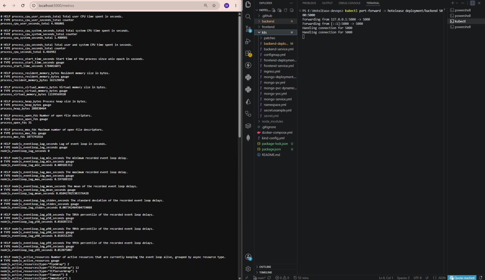
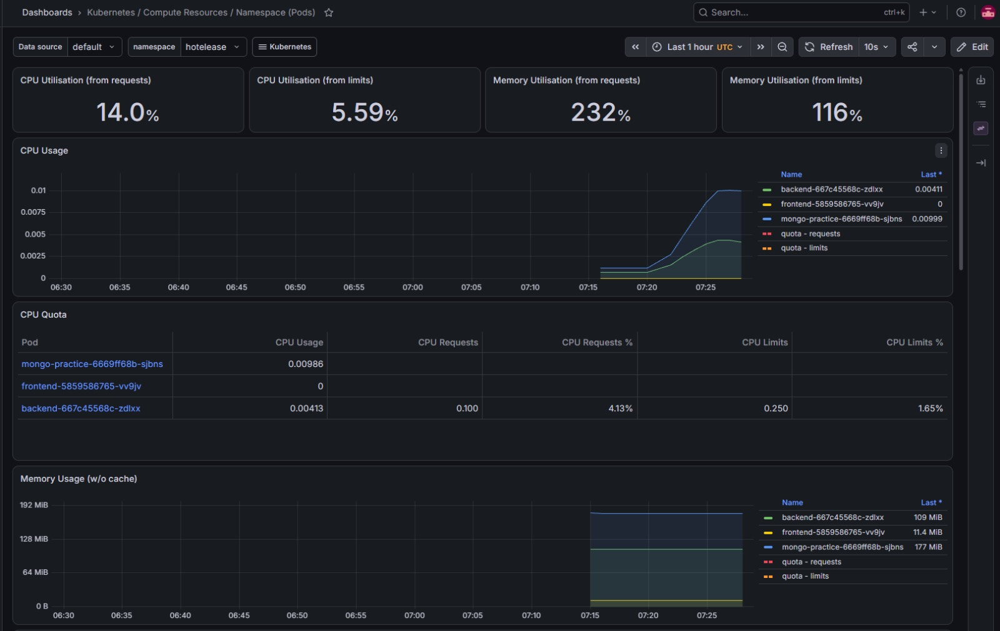
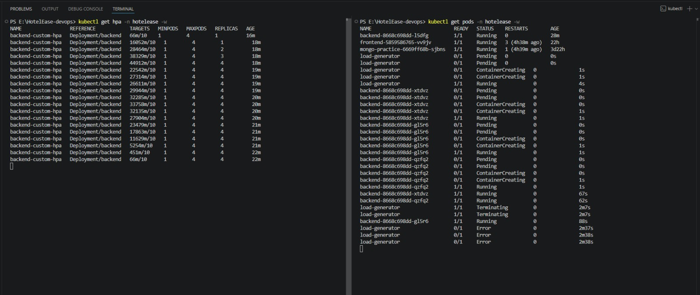

# HotelEase — Kubernetes DevOps Project

A MERN-stack hotel booking app, containerized with Docker and deployed to a local Kubernetes cluster (kind), covering storage, config management, ingress routing, autoscaling (standard + custom-metric), and monitoring.

> Note: running this with plain `kubectl apply` on a single-node kind cluster behaves a lot like `docker-compose up` — one command brings up every service defined in the manifests. Kubernetes just adds self-healing, scaling, and service discovery on top.

## Tech Stack
- Frontend: React (Vite) + Nginx
- Backend: Node.js + Express
- Database: MongoDB Atlas (real data) + in-cluster Mongo (storage practice)
- File Storage: Cloudinary
- Containerization: Docker
- Orchestration: Kubernetes (kind — Kubernetes in Docker)
- Ingress: NGINX Ingress Controller
- Metrics: metrics-server (CPU/mem) + Prometheus + prom-client (custom app metrics)
- Autoscaling: HPA — standard (CPU) and custom-metric (Prometheus Adapter)
- Monitoring: Prometheus + Grafana

## Architecture

```
                        Browser
                           │
                           ▼
                  ┌─────────────────┐
                  │  Ingress (nginx) │
                  │  /      /api     │
                  └────┬─────────┬──┘
                       │         │
              ┌────────▼──┐  ┌───▼──────────┐
              │ frontend-  │  │ backend      │
              │ service    │  │ service      │
              └────┬───────┘  └───┬──────────┘
                   │              │
              ┌────▼──────┐  ┌────▼────────────┐
              │ frontend  │  │ backend         │
              │ pod (nginx)│  │ pod (Express)   │
              └───────────┘  │  /metrics ─┐    │
                              └────────────┼────┘
                                           │
                    ┌──────────┬──────────┼─────────────┐
                    ▼          ▼          ▼             ▼
                 Secret   ConfigMap  MongoDB Atlas  Prometheus
              (credentials)(settings)   (cloud)     (scrapes /metrics)
                                                          │
                                                          ▼
                                                    Prometheus Adapter
                                                          │
                                                          ▼
                                              Custom-metric HPA (backend)

        Namespace: hotelease (everything above runs inside it)
```

Separately, a `mongo-practice` Deployment + Service + PVC/PV exist purely to demonstrate storage concepts (ephemeral vs static PV vs dynamic PV) — not used by the real app, which connects to MongoDB Atlas.

## Project Structure

```
HotelEase-k8s/
├── backend/
│   └── Dockerfile
├── frontend/
│   └── Dockerfile
├── images/                       (screenshots — see below)
├── k8s/
│   ├── namespace.yml
│   ├── backend-deployment.yml
│   ├── backend-service.yml
│   ├── frontend-deployment.yml
│   ├── frontend-service.yml
│   ├── secret.yml                (gitignored — real credentials)
│   ├── secret.example.yml        (template, safe to commit)
│   ├── configmap.yml
│   ├── mongo-deployment.yml
│   ├── mongo-service.yml
│   ├── mongo-pv.yml
│   ├── mongo-pvc.yml
│   ├── mongo-pvc-dynamic.yml
│   ├── ingress.yml
│   ├── hpa.yml                   (standard CPU-based HPA)
│   └── hpa-custom-metric.yml     (Prometheus-based HPA)
├── metrics-server-patch.yml      (kubelet-insecure-tls fix for kind)
├── kind-config.yml
└── docker-compose.yml            (legacy — pre-Kubernetes setup)
```

## What's been built

### Phase 1 — Cluster setup + core deployments
- Local `kind` cluster with port mappings (80/443) for Ingress
- `hotelease` namespace
- Backend Docker image built, loaded into cluster, deployed

### Phase 2 — Storage
- Practiced all three storage patterns on a throwaway Mongo pod:
  - **Ephemeral** (`emptyDir`) — data lost on pod restart
  - **Static PV/PVC** (hostPath) — manually created volume, survives restarts
  - **Dynamic PV** — PVC requests storage from a StorageClass, PV auto-provisioned on first use (`WaitForFirstConsumer`)
- Added an `emptyDir` volume to the backend for a temp cache folder

### Phase 3 — Secrets + ConfigMaps
- Secret for sensitive values (`MONGO_URI`, `JWT_SECRET`, `CLOUDINARY_API_SECRET`)
- ConfigMap for non-sensitive config (`PORT`, `CLOUDINARY_CLOUD_NAME`, `FRONTEND_URL`)
- Both injected into the backend two ways: env vars, and mounted volume
- Confirmed backend connects to real MongoDB Atlas and Cloudinary using injected values

### Phase 4 — Ingress + Ingress Controller
- Installed NGINX Ingress Controller (kind-specific manifest)
- Added `frontend-deployment.yml` / `frontend-service.yml` (frontend runs in-cluster from this phase on)
- Added `backend-service.yml` for a stable backend name
- Path-based routing: `/` → frontend, `/api` → backend

**Debugging note:** the frontend's nginx config (baked in from the old Docker Compose setup) had a hardcoded reverse-proxy rule expecting an upstream host named exactly `backend`. Kubernetes resolves Services by exact name, so naming the Service `backend-service` caused an unresolvable-host crash (`CrashLoopBackOff`). Fixed by naming the Service `backend` instead of rebuilding the image. Also removed the Ingress `rewrite-target: /` annotation, since Express expects the full `/api/...` path.

### Phase 5 — Metrics + standard autoscaling
- Added CPU resource `requests`/`limits` to the backend Deployment
- Installed `metrics-server` (with a kind-specific patch for `--kubelet-insecure-tls`, since kind's kubelet certs aren't signed for metrics-server's default trust)
- Created a standard HPA — scales backend 1→4 replicas at 50% CPU target
- Verified live scale-up and scale-down with `kubectl top` and load testing


*HPA reacting to CPU load, replica count scaling up in real time.*

### Phase 6 — Custom-metric autoscaling with Prometheus
- Added `prom-client` to the backend and exposed a `/metrics` endpoint (default Node.js metrics: CPU, memory, event loop lag, plus request counters)
- Deployed Prometheus (scrapes the backend's `/metrics`) and Grafana (dashboards on top of Prometheus)
- Deployed the Prometheus Adapter to expose a chosen Prometheus metric as a Kubernetes custom metric
- Created a second HPA (`hpa-custom-metric.yml`) that scales the backend on that custom metric instead of CPU
- Verified scaling behavior end-to-end, separate from the CPU-based HPA


*Raw output of the backend's `/metrics` endpoint.*


*Grafana dashboard visualizing backend metrics scraped from Prometheus.*


*Custom-metric HPA scaling the backend based on the Prometheus metric instead of CPU.*

## Environment Variables

`backend` Secret (`k8s/secret.yml`, gitignored) / ConfigMap (`k8s/configmap.yml`):
```
MONGO_URI=
JWT_SECRET=
CLOUDINARY_API_SECRET=
PORT=
CLOUDINARY_CLOUD_NAME=
FRONTEND_URL=
```
See `k8s/secret.example.yml` for the Secret template — encode real values with `echo -n "value" | base64` before use.

## Run locally

```bash
git clone https://github.com/HayyanHaider/HotelEase-k8s.git
cd HotelEase-k8s

# create the cluster
kind create cluster --name hotelease --config kind-config.yml

# build + load images
docker build -t hotelease-backend:v1 ./backend
docker build -t hotelease-frontend:v1 ./frontend
kind load docker-image hotelease-backend:v1 --name hotelease
kind load docker-image hotelease-frontend:v1 --name hotelease

# apply core manifests
kubectl apply -f k8s/namespace.yml
kubectl apply -f k8s/secret.yml       # copy from secret.example.yml first
kubectl apply -f k8s/configmap.yml
kubectl apply -f k8s/backend-deployment.yml
kubectl apply -f k8s/backend-service.yml
kubectl apply -f k8s/frontend-deployment.yml
kubectl apply -f k8s/frontend-service.yml

# ingress controller + routing
kubectl apply -f https://raw.githubusercontent.com/kubernetes/ingress-nginx/main/deploy/static/provider/kind/deploy.yaml
kubectl apply -f k8s/ingress.yml

# metrics + standard HPA
kubectl apply -f metrics-server-patch.yml
kubectl apply -f k8s/hpa.yml

# custom-metric HPA (after Prometheus + Adapter + Grafana are installed)
kubectl apply -f k8s/hpa-custom-metric.yml
```

App available at `http://localhost/`.

## Legacy: Docker Compose deployment

Before this Kubernetes-based setup, the project was deployed as plain Docker containers on an Azure VM via GitHub Actions CI/CD. That workflow (`docker-compose.yml`, `.github/workflows/deploy.yml`) is kept in the repo for reference but is no longer the primary deployment path.